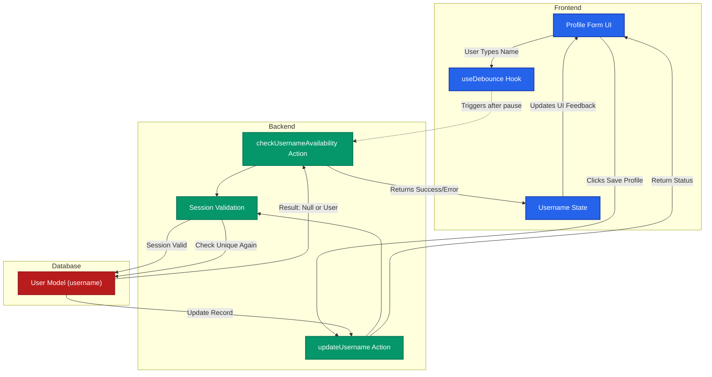
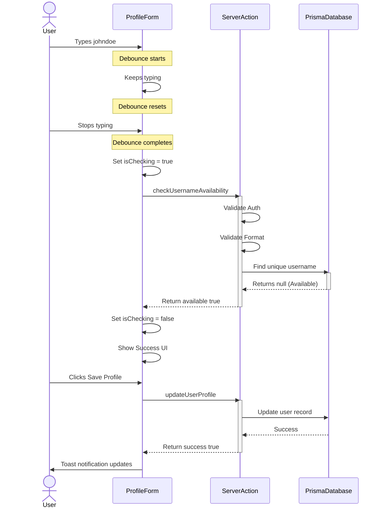
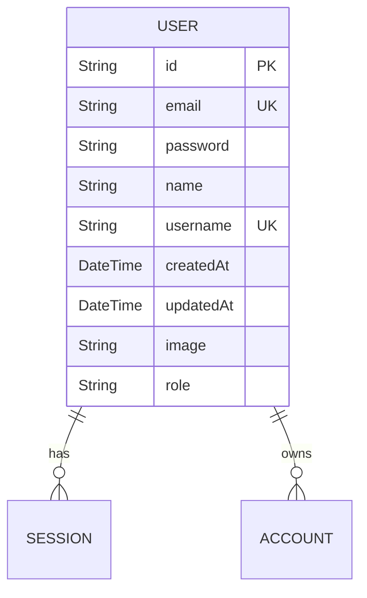

# Technical Blueprint: Unique Username Feature

This blueprint illustrates the architecture and data flow for the unique username feature.

## 1. System Architecture & Data Flow

This flowchart shows the overall flow of data from the UI to the database when a user interacts with the username field.

---

## 2. Sequence Diagram: Real-Time Availability Check

This sequence diagram details the exact interactions that occur when a user types a new username to check if it's available.

---

## 3. Database Schema Changes

